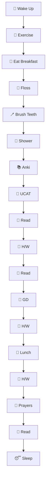

```mermaid
graph TD
    A[🌅 Wake Up] --> B[💪 Exercise]
    B --> C[🍳 Eat Breakfast]
    C --> D[🦷 Floss]
    D --> E[🪥 Brush Teeth]
    E --> F[🚿 Shower]
    F --> G[📚 Anki]
    G --> H[📖 UCAT]
    H --> I[📘 Read]
    I --> J[📝 H/W]
    J --> K[📙 Read]
    K --> L[💬 GD]
    L --> M[📝 H/W]
    M --> N[🍲 Lunch]
    N --> O[📝 H/W]
    O --> P[🙏 Prayers]
    P --> Q[📗 Read]
    Q --> R[😴 Sleep]
```