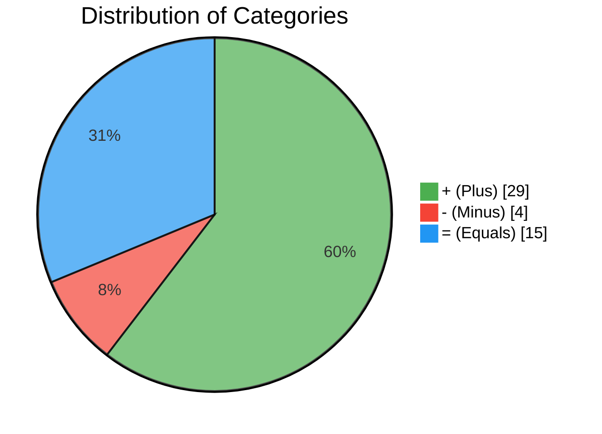
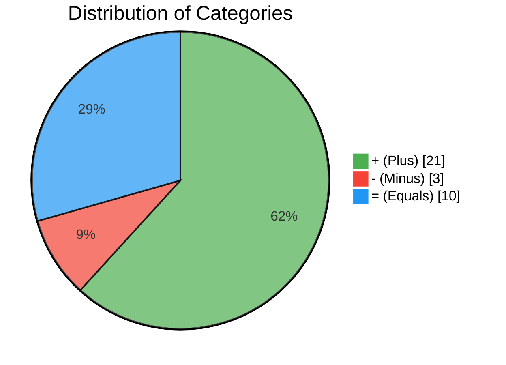
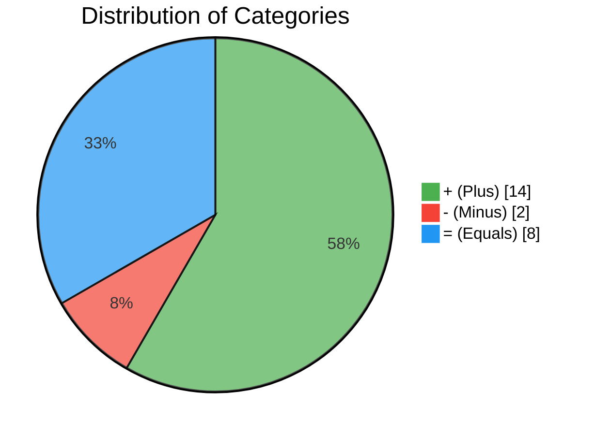
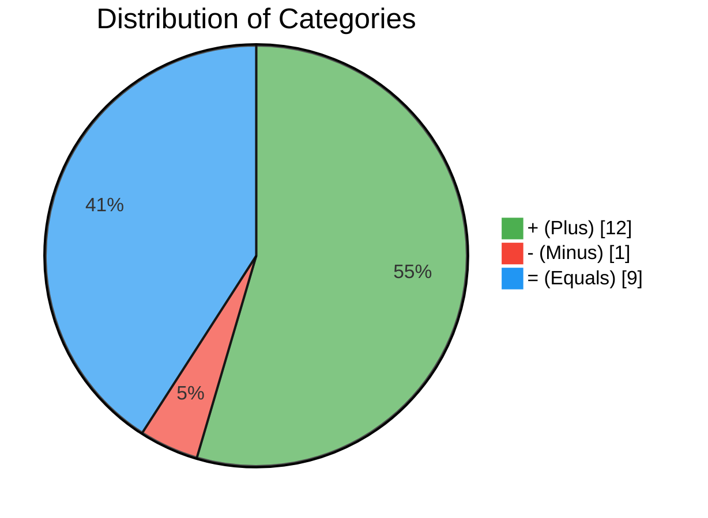
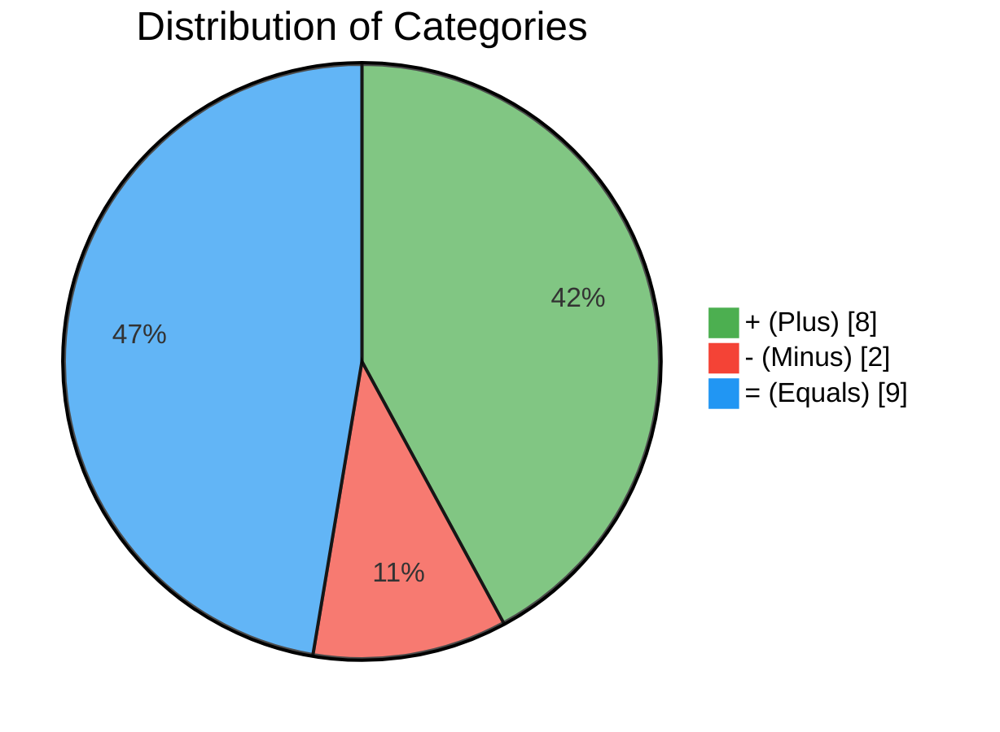
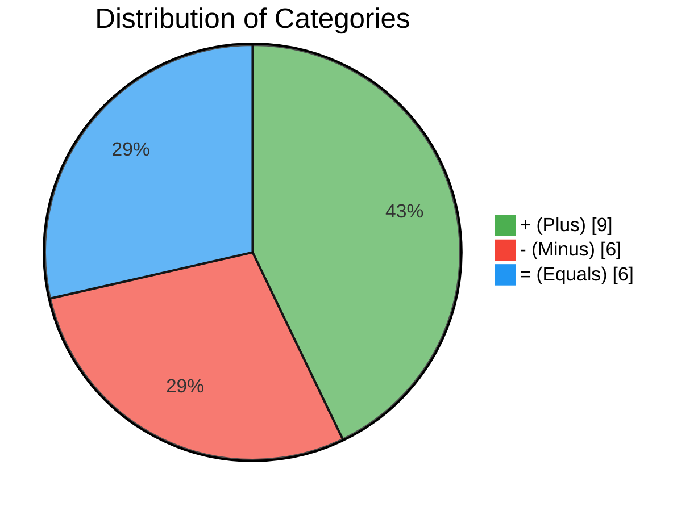

# 23/2/25 (Sunday)
- Wake up =
- Toilet =
- Eat breakfast =
- Wash dishes +
- Read +
- Check phone -
- Anki +
- Internet -
- UCAT training +
- UCAT qr +
- Brush teeth =
- Wash face =
- Obsidian biology +
- Book+ 
- Obsidian biology +
- Phone -
- Obsidian biology +
- Change =
- Church =
- Change =
- Breakfast =
- Water +
- Duolingo +
- Obsidian bio +
- Internet -
- Obsidian chem +
- Chem study minds +
- Read +
- Sainsbury's =
- Read +
- Hoover +
- Read +
- Game +
- Food =
- Read +
- Prayers =
- Hair oil +
- Wash bottle +
- Polish shoe +
- Brush teeth =
- Get fresh clothes +
- Shave +
- Shower +
- Wash face +
- Hair food +
- Face cream +
- Get school clothes +
- Organise maths folder +
- Pack bag+
- Change bed sheets+
- Moist hand +
- Update scoreboard+
- Read +
- Bed =
- **+ (Plus)**: 29
- **- (Minus)**: 4
- **= (Equals)**: 15

# 24/2/25
- Wake up =
- Toilet =
- Stretch +
- Breakfast =
- Floss +
- Brush teeth =
- Fill water +
- Anki +
- Ucat training +
- Ucat Qr +
- Mentorverse Wex +
- Face +
- Make lunch =
- Change =
- Vaseline +
- Hands  +
- Check targets +
- School =
- Wash lunchbox + 
- Fill water +
- Change + hang
- Duolingo + 
- Food =
- Phone -
- Bio exam qs +
- Bio anki update +
- Internet  -
- Read +
- Prayers =
- TV -
- Shower +
- Face +
- Vaseline +
- Wex notes +
- Cream +
- Read + 
- Sleep =
- **+ (Plus)**: 21
- **- (Minus)**: 3
- **= (Equals)**: 10

# 25/2/25
- Wake up =
- Toilet =
- Stretch +
- Breakfast  =
- Wash dish +
- Get water + 
- Bio vids +
- Internet  -
- Fill water + 
- Face +
- Cream +
- Vaseline +
- Hand +
- Hair +
- School =
- Hw club +
- Badminton + 
- Change =
- Food =
- Maths hw +
- Internet  -
- Food =
- Prayers =
- Face +
- Hands +
- Sleep =
- **+ (Plus)**: 14
- **- (Minus)**: 2
- **= (Equals)**: 8

# 26/2/25
- Wake up =
- Stretch + 
- Exercise +
- Breakfast = 
- Brush teeth =
- Shower +
- Face =
- Hair =
- Anki +
- UCAT +
- Change =
- Make lunch +
- Fill water + 
- Hand +
- School =
- Food =
- Chem hw +
- internet -
- Brush teeth =
- Face = 
- Cream + 
- Vaseline + 
- Read + 
- Sleep =
- **+ (Plus)**: 12
- **- (Minus)**: 1
- **= (Equals)**: 9

# 27/2/25
- Wake up =
- Toilet =
- Breakfast = 
- Internet - 
- Fill water + 
- Bio videos +
- Bio exam qs +
- Brush teeth = 
- shower +
- Change =
- Bio videos +
- School =
- Food =
- TV -
- Anki +
- UCAT +
- Brush teeth =
- Face +
- Hands +
- Sleep =
- **+ (Plus)**: 8
- **- (Minus)**: 2
- **= (Equals)**: 9

# 28/2/25
- Wake up = 
- Toilet =
- Stretch +
- Breakfast =
- Internet -
- Anki +
- Internet -
- Shower +
- Face +
- Change =
- Vaseline + 
- Hands +
- School =
- Wash lunchbox +
- Change =
- Scoreboard update +
- Mermaid chart +
- TV - 
- movie - 
- Tv -
- Movie -
- Brush teeth =
- Face + 
- Sleep late -
- **(Plus): 9**
- **(Minus): 6**
+ **(Equals): 6**

