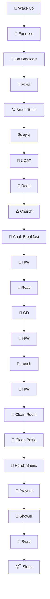

```mermaid
graph TD
    A[🌅 Wake Up] --> B[💪 Exercise]
    B --> C[🍳 Eat Breakfast]
    C --> D[🦷 Floss]
    D --> E[😁 Brush Teeth]
    E --> F[📚 Anki]
    F --> G[📖 UCAT]
    G --> H[📘 Read]
    H --> I[⛪ Church]
    I --> J[🍳 Cook Breakfast]
    J --> K[📝 H/W]
    K --> L[📙 Read]
    L --> M[💬 GD]
    M --> N[📝 H/W]
    N --> O[🍲 Lunch]
    O --> P[📝 H/W]
    P --> Q[🧹 Clean Room]
    Q --> R[🧴 Clean Bottle]
    R --> S[👞 Polish Shoes]
    S --> T[🙏 Prayers]
    T --> U[🚿 Shower]
    U --> V[📗 Read]
    V --> W[😴 Sleep]
```

