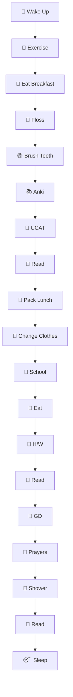

```mermaid
graph TD
    A[🌅 Wake Up] --> B[💪 Exercise]
    B --> C[🍳 Eat Breakfast]
    C --> D[🦷 Floss]
    D --> E[😁 Brush Teeth]
    E --> F[📚 Anki]
    F --> G[📖 UCAT]
    G --> H[📘 Read]
    H --> I[🍱 Pack Lunch]
    I --> J[👕 Change Clothes]
    J --> K[🏫 School]
    K --> L[🍲 Eat]
    L --> M[📝 H/W]
    M --> N[📙 Read]
    N --> O[💬 GD]
    O --> P[🙏 Prayers]
    P --> Q[🚿 Shower]
    Q --> R[📗 Read]
    R --> S[😴 Sleep]
```

